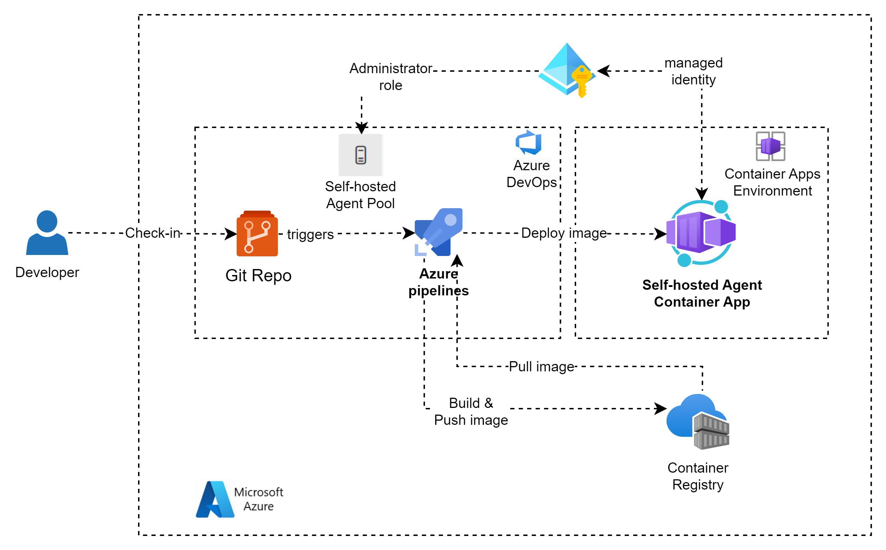
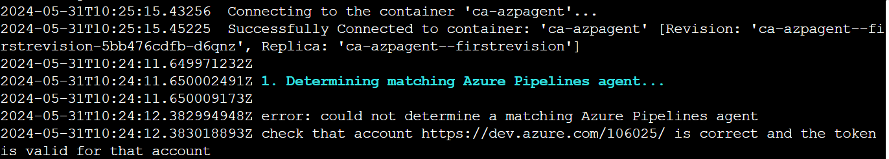
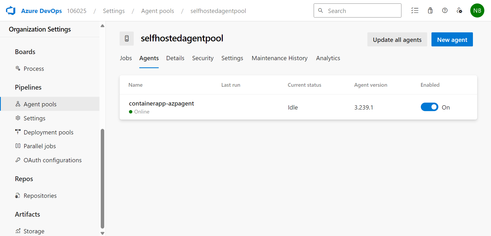

# Azure DevOps self hosted agent in Azure Container App

This is the companion repository for the [Run a self hosted agent in Docker](https://learn.microsoft.com/en-us/azure/devops/pipelines/agents/docker?view=azure-devops) and [Deploy to Azure Container Apps from Azure Pipelines](https://learn.microsoft.com/en-us/azure/container-apps/azure-pipelines). 

This repository helps Azure DevOps engineers to setup Azure DevOps self-hosted agent running in Azure Container App

## Architecture


### Components

#### Azure DevOps
Source code is maintained in Azure DevOps Git repository. This pipeline will be triggered when a developer check-in code to Git repository.

#### Azure Container Registry
Stores self hosted agent container images. You can also use other container registries like Docker Hub.

#### Azure Container Apps
Container App runs Azure DevOps self hosted agent container and listen for any pipeline jobs queued and runs them.

## Getting Started

In this quick start, you create Azure DevOps pipeline which deploys Bicep script to create an Azure container registry, run registry task to build image from a Dockerfile and push to container registry, create user assigned managed identity, assign acrPull role on container registry, create container app with both self assigned managed identity & user assigned managed identity, set the registry with the image from container registry and set environment variables AZP_URL, AZP_AGENT_NAME, AZP_POOL and AZP_TOKEN.

Here is the summary of the code files in this repository:

ContainerApp/azure-pipelines.yml: The pipeline is triggered on changes to the main branch. It uses the AzureResourceManagerTemplateDeployment@3 task to deploy resources to Azure using the main.bicep file.

ContainerApp/start.sh: This is a bash script that is used to start an Azure DevOps agent in an Azure Container App. It fetches an access token from an Azure Container App using system assigned managed identity and uses it to authenticate the agent. It also handles cleanup of the agent configuration upon exit.

ContainerApp/main.bicep: This is a bicep template for deploying resources to Azure. The template is used by the AzureResourceManagerTemplateDeployment@3 task in the Azure DevOps pipeline.

ContainerApp/Dockerfile: This file contains instructions for building a Docker image that is used to run the Azure DevOps agent.

The files in the ContainerAppWithPAT directory uses a Personal Access Token (PAT) for authentication instead of the container app's managed identity.

You can use the files from ContainerApp or ContainerAppWithPAT depending on your requirement

### Create an Azure DevOps repository and clone the source code
Create a new Git repository in Azure DevOps and clone the source code from [Github repo](https://github.com/bnagajagadeesh/azuredevopsagent-ca.git).

run the following command to clone the repository
```bash
git clone https://github.com/bnagajagadeesh/azuredevopsagent-ca.git azuredevopsagent
```

### Create an Azure DevOps service connection
In your Azure DevOps project, select Pipelines.

Select New pipeline.

Select Azure Repos Git.

Select the repo that contains your source code (azuredevopsagent-aci).

Existing Azure Pipelines YAML file

Select /ContainerApp/azure-pipelines.yml or /ContainerAppWithPAT/azure-pipelines.yml

Select Save and run.

An Azure Pipelines run starts to build and deploy your container App. To check its progress, navigate to Pipelines and select the run. During the first pipeline run, you may be prompted to authorize the pipeline to use your service connection.

### Create an Azure DevOps YAML pipeline
Create a new Azure DevOps YAML pipeline using [azure-pipelines.yml](azure-pipelines.yml). You can refer to  [create an azure devops yaml pipeline](https://learn.microsoft.com/en-us/azure/container-apps/azure-pipelines#create-an-azure-devops-yaml-pipeline) for detailed steps.

#### Create Personal Access Token
This step is required only if you want to use Personal Access Token (PAT) based authentication. Create a new PAT in Azure DevOps and note down token generated. You can refer to [Create a PAT](https://learn.microsoft.com/en-us/azure/devops/organizations/accounts/use-personal-access-tokens-to-authenticate?view=azure-devops&tabs=Windows#create-a-pat) for detailed steps.

#### Create a new secret variable
This step is required only if you want to use PAT based authentication. Create a new secret variable called "azpToken" and set the value with the PAT value generated in the previous step. You can refer to [Secret variable in the UI](https://learn.microsoft.com/en-us/azure/devops/pipelines/process/set-secret-variables?view=azure-devops&tabs=yaml%2Cbash#secret-variable-in-the-ui) for detailed steps.

### Create Agent pool
Create a new agent pool following steps given [here](https://learn.microsoft.com/en-us/azure/devops/pipelines/agents/pools-queues?view=azure-devops&tabs=yaml%2Cbrowser#create-agent-pools) 

## Build

### Build and deploy to Container Apps
Run Azure DevOps pipeline which uses AzureResourceManagerTemplateDeployment@3 task to run main.bicep file.

This main.bicep file deploys an Azure Container App with a self-hosted Azure DevOps agent running as a conainter. Here's a summary of what it does:

Parameters: It defines a set of parameters that can be used to customize the deployment, such as the names of the container app, environment, and log analytics workspace, the location for all resources, the minimum and maximum number of replicas, the name of the Azure Container Registry (ACR), and details about the Git repository and Docker image.

Log Analytics Workspace: It creates a Log Analytics workspace for monitoring the container app.

Azure Container Registry (ACR): It creates an ACR for storing Docker images.

Build ACR Image: It uses a module to build a Docker image from a Git repository and push it to the ACR.

User Assigned Identity (UAI): It creates a UAI and assigns it the ACR Pull role, allowing the container app to pull images from the ACR.

Container App Environment: It creates a container app environment with a consumption-based pricing model.

Container App: It creates a container app with the UAI and deploys it to the container app environment. The app is configured to use the Docker image from the ACR, and it's scaled based on CPU utilization.

You get an error in container app after the deployment due to missing permissions. 


To fix this issue, you need to add below permissions in Azure DevOps

Add System assigned managed identity of Container App to 
 1) Azure DevOps Orgnization settings - users and
 2) Add an Azure Managed Identity to an Azure DevOps agent pool follow these steps:  

Navigate to your Azure DevOps organization.  
Go to Project Settings.  
Under Pipelines, select Agent Pools.  
Select the desired agent pool.  
Go to the Security tab.  
Click on "Add" and then "Add Azure AD user or group".  
In the dialog box that appears, search for the name of your Managed Identity.  
Select the Managed Identity from the list, Select Role as "Administrator" and click on "Add".  

### Test
Naviate to Azure DevOps - Orgnization settings - Pipelines - Agent pools - selfhostedagentpool - Agents

You should see one agent running with the status online as shown in the screenshot below.




## Contribute
Contributions to AzureDevOpsAgent are welcome. Here is how you can contribute:

[Submit bugs](https://github.com/bnagajagadeesh/azuredevopsagent-ca/issues) and help us verify fixes.
[Submit pull requests](https://github.com/bnagajagadeesh/azuredevopsagent-ca/pulls) for bug fixes and features and discuss existing proposals

## License
Code licensed under the [GNU GENERAL PUBLIC LICENSE](LICENSE).

## Contact Us
If you have questions or you would like to reach out to us about an issue you're having or for development advice as you work on a issue, you can reach us as follows:

Open an [issue](https://github.com/bnagajagadeesh/azuredevopsagent-ca/issues/new) and prefix the issue title with [Question]. See [Question](https://github.com/bnagajagadeesh/azuredevopsagent-ca/issues?q=label%3AQuestion) tag for already-opened questions.